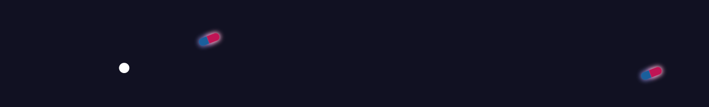

### Developed by:
* Beatrice Curti
* Emanuele Leonardi
* Matteo Tarda

### Course:
[Creative Coding 2018/2019](https://drawwithcode.github.io/2018/)<br>
**Politecnico di Milano** - Scuola del Design<br>
**Faculty:** Michele Mauri, Tommaso Elli


## Project idea

The main concept behind our project is Anxiety, not everyday anxiety but unreasonable levels of anxiety that affect many of us and make it difficult to complete even simple tasks.<br>
We want to raise awareness on anxiety disorders through a simple interaction that shows how hard it is to keep up when not in complete control of ourselves.

## Developement

To keep the code simple and easy to read we went with a more object oriented structure, so that the core of the **draw loop** is:
```
Game.update();
Game.draw();
```
While the rest of the code in the function is used to handle other parts of the sketch like *Title Screen*, *Ending Screen*...

### Game object

The Game object contains the list of entites, some timers and the functions to update and draw the entities:

```
const GameI = function () {
    let entities;
    let nextCircle;
    let nextBullet;
    let nextPill;

    this.init = function () {...}

    this.addEntity = function (newEntity) {...}

    this.update = function () {...};

    this.draw = function () {...};

}
```

Since our solution is object oriented, the **draw** and **update** functions mainly just call the same named functions in our Entities, as we can see in the next section.

### Entity objects

All the entities have the same functions used to **update** and **draw** them and some also have other *utility* functions.

#### Bar


```
const Bar = function () {
    let val;
    let acc;
    
    this.drawExtra = function () {};

    this.draw = function () {...}

    this.update = function () {...}
}
```
The Bar object is very simple, there is only one of it on screen but it manages a fundamental interaction of the experience, the two local variables are used to position and move the pointer on it.

#### Circle


```
const Circle = function () {
    this.position = [...];
    
    this.update = function (i, arr) {...}
    
    this.drawExtra = function () {...}
    
    this.draw = function () {...}
    
    this.mouseIsOn = function () {...}
}
```
The circles are just a bit more complex, the object has a position property and aside from the necessary functions it also has a function that checks for the mouse position.

#### Bullet


```
const Bullet = function () {
    this.position = function () {...}();
    
    this.update = function (i, arr) {...}
    
    this.draw = function () {...}
    
    this.drawExtra = function () {...}
    
    this.inReach = function () {...}

    this.touch = function () {...}
}
```
Like the previous object the Bullet object has more methods to handle different interactions and checks.

#### Pill



```
const Pill = function () {
    this.position = [...];
    
    this.update = function (i, arr) {...}
    
    this.drawExtra = function () {}
    
    this.draw = function () {...}
    
    this.mouseIsOn = function () {...}
}
```
The Pill is instead more simple in structure but the code inside makes it a bit tricky as it isn't always reliable, it's effect is tied to the number of entities in game.

All the entites have a *drawExtra* function used to make the glitchy effect, on some of these object it is left empty as they don't have said effect applied to them.

## Challenges

The main challenge was to design the right interactions for the feelings that we're trying to convey and to make the experience balanced.

## Inspirations/References

- [Grid 16](https://armorgames.com/play/841/grid16) - For the multitasking aspect of the experience.
- [Fahrenheit/Indigo Prophecy](https://www.youtube.com/watch?v=AynRWv4iCyA) (Archives Chapter) - For interactions.
- [SLEEP PHASES](https://jandornig.github.io/SLEEP_merge/) - For graphic style.